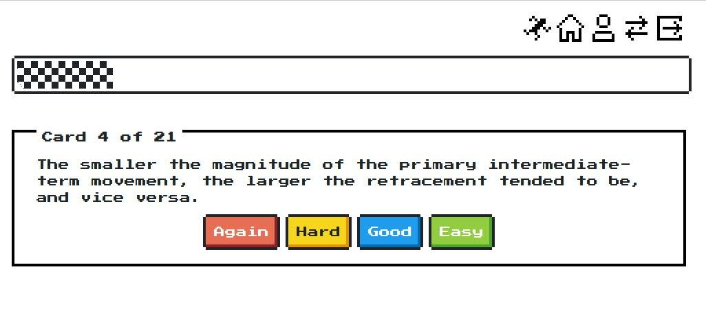

# Srsly

Srsly is spaced-repetition using the Hypothes.is annotation platform. See [this blog post](https://blog.jethro.dev/posts/taking_srs_seriously/) for more details.

## Using Srsly

Srsly is hosted at https://srsly.netlify.app/, you are free to use it.

Disclaimer: note that using the service means me (the service owner) is able to
see things, such as your Hypothesis token and your flashcards. If that bothers
you then don't use it.

## Credits

- Theme: https://nostalgic-css.github.io/NES.css/
- Icons: https://pixelarticons.com/
